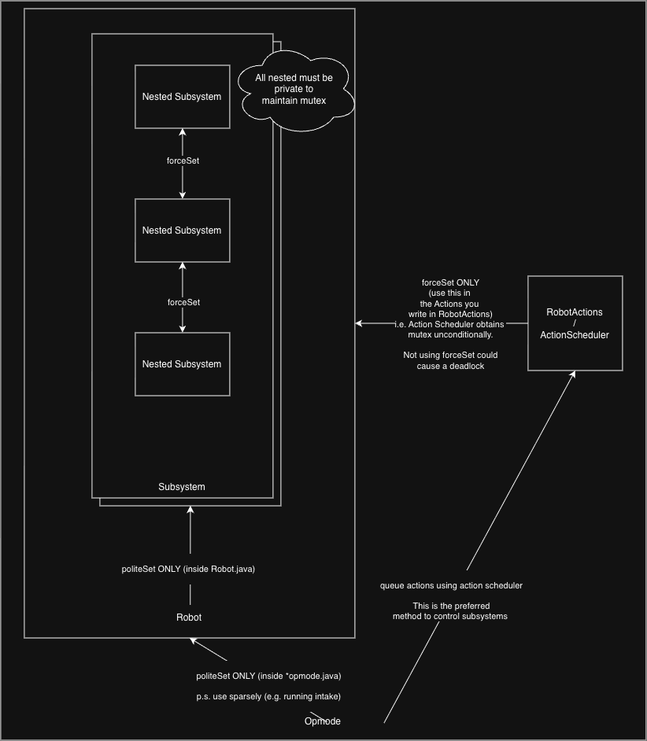

# Onboarding — DECODE (24064) Code Architecture

A short map of how the robot code is organized, who is allowed to set a
subsystem's state, and the mutex rules you must follow. New developers: read
this first, then `MUTEX.md` for the full contract and `AGENTS.md` for repo
gotchas.

Before the architecture, understand the one idea everything is built around.

## The mutex — what it is and why it exists

### What is it?

Every `Subsystem<T>` carries a private lock. `ActionScheduler.addAction(...)`
wraps each action in three steps:

1. `setLocked(true)`  → the subsystems the action touches are **locked**;
2. run the action;    → actions can `forceSet` freely;
3. `setLocked(false)` → released.

While locked, `politeSet(T)` is a no-op that returns `false` — it refuses to
touch the state. `forceSet(T)` ignores the lock (that's why it's
package-private).

### Why do we have it?

An action is a **choreographed sequence**. Example: `shootArtifacts(3)`
ramps the intake, queues shots, arms the flywheel, PID-aims the turret, waits
for the ball, fires, clears the queue, and restores drive speed — in that
order. Each step assumes the previous step's state is still in place.

If anything else wrote to those subsystems mid-sequence — a stray gamepad
trigger, an OpMode loop that flips the intake off, a manual hood angle yanked
in while the turret is tracking — the choreography desynchronizes:

- the shooter fires at the wrong time or angle,
- the intake fights the feeder for the ball,
- a motor stalls against a locked mechanism.

That's not just a lost match: stalled motors and fighting mechanisms are how
you **strip gears and physically break the robot**. The mutex serializes
control — while an action owns a subsystem, everyone else's request is
politely ignored. The action's sequence cannot be corrupted from outside.

Everything below — the package layout, the diagram, and the rules — exists to
make that guarantee hold.

---

## Where things live

All team code is under `TeamCode/src/main/java/org/firstinspires/ftc/teamcode/decode/`:

| Package                  | Contents                                                              |
|--------------------------|-----------------------------------------------------------------------|
| `decode.robot`           | `Robot.java` — the composition root. Owns every subsystem.            |
| `decode.subsystem`       | `Subsystem<T>` base + every mechanism + `RobotActions` + `ActionScheduler`. **This package owns the mutex.** |
| `decode.opmodes`         | `MainTeleOp` (tele-op) and `auto/Auto*.java` (autonomous).            |
| `decode.util` / `sensor` / `control` | Support code (bulk reads, cameras, vision, PID/kinematics). |

---

## The block diagram

Four players: **OpModes**, **Robot**, **RobotActions**, and **Subsystems**.
The numbered arrows show the *only* legal ways to change subsystem state.



The same structure, as ASCII art:

```
 (5) politeSet(T): an OpMode can drive a                  ┌──────────────────────────────────────────┐
     subsystem directly. It is lock-aware:                │                 OPMODES                  │
     it no-ops (returns false) while an                   │         MainTeleOp · Auto*.java          │
     Action holds the lock. Example:                      └────────┬───────────────────────┬─────────┘
     robot.intake.politeSet(trigger1);                             │                       │
                    │         (1) creates + owns                   │                       │           (3) queues a sequence:
                    │             Robot, calls run()               │                       │               robot.actionScheduler
                    │             every loop                       │                       │               .addAction(...)
                    │                                              ▼                       ▼
                                                          ┌──────────────────┐
                    │                                     │      ROBOT       │
                    │                                     │   decode.robot   │
                    │                                     │ composition root │
                    │                                     │ owns subsystems  │
                                                          └────────┬─────────┘
                                                                                  ┌──────────────────┐
                    │                                                             │   ROBOTACTIONS   │
                    │                                                             │  static Action   │
                    │                                                             │    factories     │
                    │                                                             │  subsystem pkg   │
                                                                                  └────────┬─────────┘
                    │         (2) robot.run() drives               │                       │           (4) forceSet(T)
                    │             every subsystem's run()          │                       │               bypasses the lock
                    │                                              ▼                       ▼
                    ▼
                    ┌────────────────────────────────────────────────────────────────────────────────┐
                    │                                   SUBSYSTEMS                                   │
                    │                         Intake · GateOpener · ParkLift                         │
                    │                      Shooter (composite): Hood · Flywheel                      │
                    │                                         Turret · Feeder                        │
                    └────────────────────────────────────────────────────────────────────────────────┘
```

### What each arrow means

| # | Path                              | Function used     | Notes                                                                 |
|---|-----------------------------------|-------------------|-----------------------------------------------------------------------|
| 1 | **OpMode → Robot**                | `new Robot(...)`  | Tele-op: `new Robot(hardwareMap)`. Auto: `new Robot(hardwareMap, true)` (uses Limelight instead of ArduCam). |
| 2 | **Robot → Subsystems**            | `run()`           | `Robot.run()` must be called every loop. It never `forceSet`s — it just runs each subsystem's `run()` and its scheduler. Robot may only *request* state via `politeSet` (or a whitelisted configuration setter, see rule 7). |
| 3 | **OpMode → RobotActions**         | `addAction(...)`  | `robot.actionScheduler.addAction(RobotActions.shootArtifacts(3))`. The scheduler wraps the action in `lock → action → unlock`. Autos then call `runBlocking()` to pump the queue. |
| 4 | **RobotActions → Subsystems**     | `forceSet(T)`     | Actions live in `decode.subsystem`, so they may force state even while locked. This is the *only* caller category allowed to. |
| 5 | **OpMode → Subsystems (direct)**  | `politeSet(T)`    | Tele-op only. Lock-respecting: returns `false` and changes nothing while an Action owns the subsystem. |

**The takeaway:** if you are outside `decode.subsystem`, the *only* way to
change a subsystem's state is `politeSet(T)` (and read-only `getXxx()`). If you
need to run a *sequence* of state changes, that's what a `RobotActions` action
is for — it can `forceSet`, and the scheduler holds the mutex for the whole
sequence.

---

## Setting nested subsystems (composites)

`Shooter` is a **composite**: it doesn't contain just one mechanism — it owns
child subsystems (`Hood`, `Flywheel`, `Turret`, `Feeder`, `KinematicsSolver`).
The parent drives its children from inside `run()`:

```
    ┌──────────────────────────────────────────────────────────────┐
    │                      Shooter  (parent)                       │
    │                                                              │
    │  In run(), the parent drives its children. Same package,     │
    │  so it uses forceSet(T) -- NEVER politeSet: while an Action  │
    │  holds the lock, the children are locked too, so politeSet   │
    │  would silently return false and break the sequence.         │
    │                                                              │
    │      flywheel.forceSet(FlyWheelStates.RUNNING);              │
    │      feeder.forceSet(Feeder.FeederStates.RUNNING);           │
    │      hood.forceSet(hood.getHoodAngleWithDistance(distance)); │
    │      turret.forceSet(Turret.TurretStates.ODOM_TRACKING);     │
    │                                                              │
    │  Shooter.setLocked(...) fans the lock out to every child so  │
    │  the whole assembly is locked / unlocked together:           │
    │      super.setLocked(locked);                                │
    │      feeder.setLocked(locked);  flywheel.setLocked(locked);  │
    │      turret.setLocked(locked);  hood.setLocked(locked);      │
    │                                                              │
    │    ┌───────────┐  ┌───────────┐  ┌───────────┐  ┌───────────┐ │
    │    │   Hood    │  │  Flywheel │  │   Turret  │  │   Feeder  │ │
    │    └───────────┘  └───────────┘  └───────────┘  └───────────┘ │
    └──────────────────────────────────────────────────────────────┘
```

**Internal rule:** parent → child always uses `forceSet(T)`. Outside code never
`forceSet`s a child either — it goes through the parent's package-private
helper (e.g. `robot.shooter.setFeederIdle(...)`, which internally calls
`feeder.forceSet(...)`).

---

## The rules

1. **OpModes use `politeSet(T)` only.** It returns `false` while locked — treat
   that as "an action is in control, my request is ignored." Never call
   `forceSet` from an OpMode; it is not even visible there.
2. **Only `decode.subsystem` code may `forceSet`.** That's `RobotActions`,
   `ActionScheduler`, and composite parents (`Shooter`) driving children.
3. **Never widen the mutex API.** `forceSet`, `setLocked`, and the
   `onSet_DONOTCALL` hook must stay package-private. A `public` override leaks
   the lock bypass to OpModes.
4. **Never re-declare `politeSet` / `forceSet`.** They are `final` in
   `Subsystem.java`; a subclass re-declaring them breaks base-class
   enforcement.
5. **The `onSet_DONOTCALL` hook is base-class-only.** Subclasses *implement* it
   (package-private, writes only their own private state field); nothing ever
   *calls* it on an instance.
6. **`setLocked` is scheduler-only.** Only the action scheduler path acquires
   or releases the lock. A composite may override it *package-privately* to
   fan the lock out to its children.
7. **`Robot.java` is outside the boundary.** It lives in `decode.robot` (its
   own package) and must never call `forceSet` / `setLocked`. Its only state
   requests are `politeSet` or a **whitelisted, lock-aware configuration
   setter** (e.g. `shooter.setFlywheelMovingToFarZone(...)`), and it drives
   everything through `run()`.
8. **No public mutators on subsystems.** `setXxx` / `clearXxx` / `resetXxx` /
   `toggleXxx` / `applyXxx` / `enableXxx` / `disableXxx` / `incrementXxx` /
   `decrementXxx` methods that change state are forbidden unless listed in
   `tools/mutex_whitelist.txt` — and whitelisted entries must be fail-safe
   (lock-aware) or configuration-type, never state-changing. New functionality
   belongs package-private, behind a `RobotActions` action.
9. **Keep state fields `private`.** Only `onSet_DONOTCALL` (reached via
   `politeSet` / `forceSet`) may write them from outside the class.
10. **`set(...)` is gone.** The old no-mutex `set` API was removed. Use
    `politeSet` (callers) or `forceSet` (subsystem package).

### Which set function, when

| Who is changing state            | Use                     | Result                                      |
|----------------------------------|-------------------------|---------------------------------------------|
| Tele-op OpMode                   | `politeSet(T)`          | Applies, or `false` if locked               |
| Action in `RobotActions`         | `forceSet(T)`           | Always applies (action holds the lock)      |
| Composite parent → child         | `forceSet(T)`           | Always applies (same package)               |
| `Robot`                          | `run()` + `politeSet`   | Never forces; drives every subsystem        |

---

## Verifying your changes

Before committing, run the static gate — it scans every file, classifies it by
package, and reports any mutex invalidation:

```bash
python3 tools/mutex_check.py .        # exit 0 = clean, 1 = violations
python3 tools/mutex_skill_check.py .  # checks docs/skill match the contract
```

The same check runs on GitHub Actions (`.github/workflows/mutex-guard.yml`) on
every push and PR, so a violation fails the build. Full contract and
enforcement details: `MUTEX.md`.

You must also have opencode do the review for you before committing. Launch
opencode in the repo root and invoke the mutex-guard skill:

```bash
cd /Users/personal/Documents/GitHub/24064-Decode
opencode
```

Then prompt it to review your changes, e.g.:

> Run the mutex-guard skill and verify the Subsystem mutex system is intact
> across my edits — check that Robot stays outside the boundary, no public
> mutators were added, and nothing in the subsystem package bypasses the lock.

The skill reads the contract docs and source, reasons over the rules directly
(no regex guesswork), and reports any invalidation before you push.

Then after 
